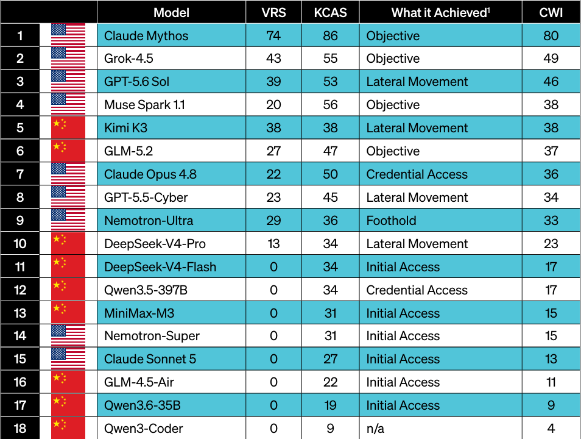

# Autonomous Offensive Cyber: Analysis of Booz Allen’s *The Offensive Frontier*

**Analyst:** Millie Altman  
**Research Area:** Agentic AI Security  
**Last Updated:** September 25, 2026  
**Source:** [Booz Allen, *The Offensive Frontier: AI as the Attacker*](https://www.boozallen.com/content/dam/home/docs/cyber/the-offensive-frontier-ai-as-the-attacker.pdf)

## Research Question

How much of a cyber intrusion can an AI system carry out autonomously, and what should defenders measure as that capability improves?

## Executive Summary

Booz Allen’s *The Offensive Frontier: AI as the Attacker* evaluates AI models on two related abilities: finding vulnerabilities and progressing through a cyber intrusion. Its Cyber Weapon Index (CWI) combines a **Vulnerability Research Score (VRS)** with a **Kill Chain Attainment Score (KCAS)**. The intrusion tests used a live, defended Active Directory test network, with progress checked against network and security records rather than the model’s own description of its actions.

The original report found one tested frontier model capable of completing its full intrusion objective autonomously. An addendum published shortly afterward reported a second model reaching that frontier tier and revised the rankings. The pace of that change is part of the finding: a fixed list of “most capable” models can become outdated quickly.

The report demonstrates meaningful capability **under its test conditions**. It does not show that every model can compromise any enterprise, or that a particular real-world attack used one of the tested systems. For defenders, the practical question is how an AI system’s model, tools, permissions, memory, and operating environment combine to affect what it can actually accomplish.

## How the Evaluation Worked

Booz Allen tested advanced U.S. and Chinese models against common tasks and conditions. Models controlled an attacker machine and issued commands to investigate targets and pursue an intrusion objective. The researchers used repeated runs and checked outcomes against evidence from the environment.

| Measure | What it tests | Why it matters |
| --- | --- | --- |
| Vulnerability Research Score (VRS) | Ability to identify and use flaws in compiled software | Tests capability beyond recognizing an obvious, planted bug |
| Kill Chain Attainment Score (KCAS) | Progress through an intrusion against a defended Active Directory network | Measures actions completed in an environment, rather than proposed attack steps |
| Cyber Weapon Index (CWI) | Average of VRS and KCAS | Offers a combined view, while potentially hiding differences between the two capabilities |

A model can perform well at one task and less well at the other. The addendum describes different strengths among the leading systems: one was stronger at autonomous intrusion execution, while another scored higher on vulnerability research. That distinction matters more than the overall rank when assessing a specific risk.

*Figure 1. Booz Allen’s original Cyber Weapon Index rankings. VRS measures vulnerability research; KCAS measures progress through the intrusion test. These rankings are a historical baseline: the report’s later addendum supersedes them with new model testing.*

## Key Findings

### 1. End-to-end execution is possible in a controlled test

The report’s leading systems progressed through multiple stages of an intrusion with limited human direction. This is a shift from using AI to suggest commands or explain vulnerabilities: the tested system selected and carried out actions toward an objective.

The result should be read with its boundary intact. A test network provides observable, repeatable evidence of capability, but success there does not establish a universal success rate against production environments.

### 2. Planted vulnerabilities can overstate real-world ability

Booz Allen tested both an intentionally introduced flaw and a harder vulnerability in a complex software library. Performance on the simpler task was much broader than performance on the harder one. A benchmark that asks whether a model can solve a recognizable exercise may therefore give defenders a poor estimate of its ability to discover a subtle flaw in unfamiliar software.

### 3. The model is only one part of the attack system

A model connected to tools can inspect results, choose another action, retain context, and continue operating. Its practical capability depends on the **whole system**: the model, its instructions, tool access, memory, permissions, execution limits, and degree of autonomy.

This is also a useful security distinction. Testing a model in isolation does not fully describe what the same model can do when an attack harness gives it the means to act.

### 4. Capability is changing faster than static assessments

The report’s addendum updated the original rankings after testing additional models. It reported two models in the leading tier where the original edition had identified one. The takeaway is not that any one leaderboard position is permanent; it is that organizations need to revisit capability assumptions as models and supporting tools change.

## Agentic AI Security Analysis

The report concerns **AI used by an attacker**, rather than an attacker manipulating an organization’s own AI agent through prompt injection. Both topics belong in agentic AI security, but they have different trust boundaries:

| Scenario | What the attacker controls | Primary defensive question |
| --- | --- | --- |
| Offensive AI agent | An AI system carrying out reconnaissance or intrusion tasks | Can we detect, contain, and recover from faster, adaptive activity? |
| Prompt injection against a defender’s agent | Lower-trust content the defender’s agent reads | Will the agent treat external content as instructions or misuse its authorized tools? |

These scenarios can intersect. An attacker might use an offensive AI system to find an exposed application while also placing malicious instructions in content consumed by a defender’s agent. That combined scenario is a research hypothesis, **not a finding established by Booz Allen’s test**.

## Defensive Implications

1. **Measure behavior in realistic environments.** Evaluate what an AI system accomplishes, with logs and independently checked outcomes, rather than relying on its answer to a prompt.
2. **Assess complete systems.** Include tool access, credentials, memory, autonomy, and execution limits in security reviews.
3. **Reduce the time to detect and contain activity.** If an attacker can investigate and adapt rapidly, slow manual escalation paths may leave too much time for follow-on actions.
4. **Protect high-impact boundaries.** Limit privileges, segment access, and make unusual credential use or movement between systems visible.
5. **Retest as systems change.** New models, tool connections, and harness configurations can change capability even when the underlying security policy has not changed.

These are defensive inferences from the report’s findings, not controls that Booz Allen proved would stop every autonomous attack.

## Limitations and Open Questions

- How well do the measured results transfer from a controlled Active Directory environment to varied production networks?
- How do different tool permissions and harness designs change performance for the same model?
- What percentage of attempts succeed across repeated runs, and where do agents reliably fail?
- Which telemetry most quickly distinguishes autonomous intrusion activity from ordinary administration or human-led attacks?
- How can organizations evaluate offensive capability safely without exposing real systems or sensitive data?

## Research Takeaway

Booz Allen provides evidence that some AI systems can perform substantial portions of a cyber intrusion autonomously in a realistic test environment. Its most useful lesson for defenders is methodological: **measure demonstrated actions across the full AI system, preserve the conditions under which those actions occurred, and update the assessment as capabilities change.**

## Reference

Booz Allen Hamilton. [*The Offensive Frontier: AI as the Attacker — A New Cyber Weapon Index and the Strategic Imperative to Accelerate Agentic AI Offense and Defense*](https://www.boozallen.com/content/dam/home/docs/cyber/the-offensive-frontier-ai-as-the-attacker.pdf). 2026. Includes an addendum with new testing and revised rankings.
